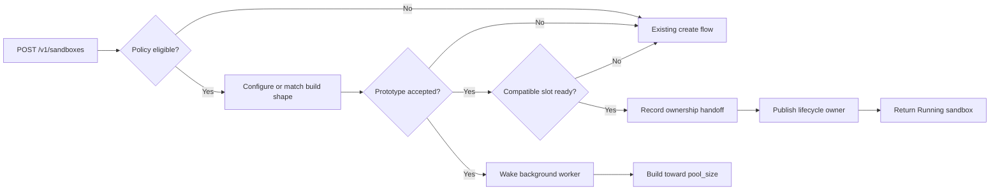

# Blaze Runtime Slots

[中文版](../../../zh/runtime/blaze/QUICKSTART.md)

Blaze can prepare independent runtime slots in the background so a compatible
sandbox create can reuse prepared storage and, optionally, an already started
backend. The feature is bounded, disabled by default, and continues through
the existing create flow whenever no compatible slot is ready.

## Requirements

- Linux with root privileges for the selected sandbox backend
- Rust 1.88 or newer for source builds
- a Blaze policy whose `[pool]` section sets `enabled = true`
- stable daemon state, storage-instance, and runtime directories across restart

## Installation

### ANOLISA CLI

Blaze is a Labs component. The source tree contains an ANOLISA component
manifest, but a configured component repository may not publish a `blaze`
candidate. Preview resolution before applying the system installation:

```bash
sudo anolisa --install-mode system --dry-run install blaze
sudo anolisa --install-mode system install blaze
```

### RPM

On an RPM repository that publishes Blaze:

```bash
sudo yum install blaze
```

### Source build

```bash
cd src/blaze
cargo build --release --locked
```

## Enable Background Capacity

Set a non-zero target in the daemon configuration:

```toml
[storage]
provider = "file"
images_dir = "/var/lib/blaze/images"
instances_dir = "/var/lib/blaze/instances"
pool_size = 2
prefork = false

[pool]
default_warm_ttl = "30m"
gc_interval = "5m"
```

Enable eligibility in each policy that may use a prepared slot:

```toml
[pool]
enabled = true
# Optional. When omitted, pool.default_warm_ttl from config.toml applies.
warm_ttl = "15m"
```

`storage.pool_size` is the target for background runtime slots. Policy `min`,
`target`, `max`, and `reset_mode` are reserved policy schema metadata. The
runtime-slot worker does not consume them, and `/v1/pools` does not apply them
from policy. None of them resizes background runtime capacity. The public reset
operation currently returns `501`, so a complete lifecycle return-to-pool
workflow is not connected.

`pool_size = 0` disables construction. Duration values must include a positive
unit: `s`, `m`, `h`, or `d`.

## Start Blaze

Use the packaged service:

```bash
sudo systemctl enable --now blazed
```

For a source checkout, run the built daemon with a configuration whose
`policy.dir` points to readable policies:

```bash
sudo ./target/release/blazed daemon start --config examples/config.toml
```

The example configuration points `policy.dir` to
`/etc/anolisa/blaze/policies`. A package installs policies there; for a source
checkout, copy the example policies to that directory or edit the configuration
to use the checkout path.

## Create and Claim a Slot

The first eligible create fixes one build shape for this daemon run and wakes
the background worker. It does not wait for the worker to fill the target, so
that request normally continues through the existing create flow. Later
compatible requests claim a ready slot when one is available:

```bash
curl -X POST --unix-socket /run/blaze/api.sock \
  http://localhost/v1/sandboxes \
  -H 'Content-Type: application/json' \
  -d '{"workload_class":"agent-tool","image_digest":"sha256:..."}'
```

The existing `start_path` field is a generic warm-start classification. A
background runtime-slot claim reports this shape:

```json
{
  "start_path": "warm",
  "instance": {
    "start_path": "warm",
    "runtime_location": "warm-pool"
  }
}
```

A `"cold"` result is not an error: this request did not use an applicable warm
source.



## Prefork Modes

| `storage.prefork` | Prepared slot | Work performed after claim |
| --- | --- | --- |
| `false` | Independent storage | Start the backend and wait for guest readiness when the backend exposes a guest endpoint |
| `true` | Independent storage plus a running backend | Check backend liveness at claim; when a guest endpoint exists, readiness was already checked before the slot became ready |

Every slot owns its own storage snapshot. A slot is never made ready by sharing
another sandbox's mutable storage.

## Capacity and Expiry

The target counts ready slots, active builds, leases being handed off, and
pool-owned slots awaiting cleanup. An ambiguous handoff has no selected
cleanup owner, but remains accounted for until reconciliation. A sandbox stops
consuming this target after lifecycle ownership is durably established.

The worker removes ready slots after their effective `warm_ttl`. Claim checks
expiry for every slot and backend liveness when the slot holds a prefork
backend. Pool cleanup failures remain owned and are retried; they continue to
consume target capacity until cleanup succeeds.

## Restart and Shutdown

Before opening its API listeners, Blaze reconciles every runtime-slot ownership
record with durable sandbox lifecycle state. It cleans unclaimed slots instead
of rebuilding the old ready queue. Any ambiguous or inconsistent record, or
runtime reconciliation step that cannot complete, stops startup. After runtime
reconciliation succeeds, ordinary sandbox lifecycle reconciliation runs; one
sandbox cleanup failure is retained and reported but does not prevent listener
startup.

Keep `daemon.state_dir`, `storage.instances_dir`, the selected storage provider,
and backend availability consistent across restart. Changing those values can
prevent the daemon from identifying and cleaning resources created by the
previous run.

During graceful shutdown, Blaze stops new slot construction, joins the worker,
and attempts bounded cleanup for every pool-owned slot. Lifecycle-owned
sandboxes follow the normal sandbox cleanup path.

## Current Boundaries

- One compatible build shape is accepted per daemon run. Requests with another
  image, backend, policy shape, or runtime configuration continue through the
  existing create flow.
- Capacity starts on the first eligible create; daemon startup does not prefill
  slots.
- Restart cleans unclaimed slots and does not restore them as ready.
- There is no public status, drain, or refill endpoint for background runtime
  slots. `/v1/pools` and the health response's `storage_pool` object refer to
  other pool contracts.
- A configured target improves the chance of a warm claim but does not
  guarantee one for every request.
- A claimed background slot is single-use: destroy releases its resources and
  the worker builds replacement capacity instead of returning that sandbox to
  the ready queue.

## Troubleshooting

| Symptom | Check |
| --- | --- |
| Every response has `start_path: "cold"` | Confirm `pool_size > 0`, policy `enabled = true`, and identical request/build inputs; then allow time for background construction |
| Slot construction keeps retrying | Inspect daemon logs for storage, backend start, or guest-readiness errors |
| Capacity appears below target | Cleanup or an unresolved handoff may still count toward the target; inspect daemon logs |
| Daemon stops during startup reconciliation | Restore the provider and directory configuration used by the previous run, then inspect the reported ownership record |

For the ownership and recovery rationale, see
[Runtime Slot Ownership](../../../../../src/blaze/docs/design/runtime-slot-ownership.md).
