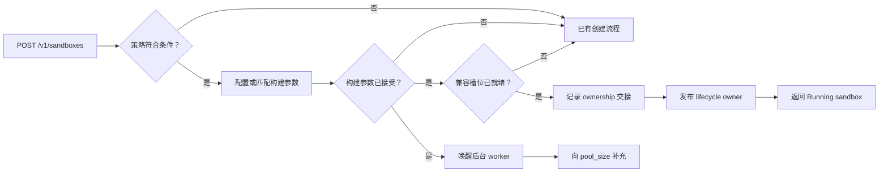

# Blaze Runtime 槽位

[English](../../../en/runtime/blaze/QUICKSTART.md)

Blaze 可以在后台准备彼此独立的 runtime 槽位，让兼容的 sandbox 创建请求
复用已准备的存储，并可选择复用已经启动的后端。该功能有容量上限、默认
关闭；没有兼容槽位就绪时，请求会继续走已有创建流程。

## 环境要求

- Linux；所选 sandbox 后端需要 root 权限
- 从源码构建时需要 Rust 1.88 或更高版本
- Blaze 策略的 `[pool]` 设置 `enabled = true`
- daemon 状态目录、存储 instance 目录和 runtime 目录在重启前后保持稳定

## 安装

### ANOLISA CLI

Blaze 当前是 Labs 组件。源码树中包含 ANOLISA 组件清单，但配置的组件仓库
不一定发布 `blaze` 候选包。执行系统级安装前，先预览解析结果：

```bash
sudo anolisa --install-mode system --dry-run install blaze
sudo anolisa --install-mode system install blaze
```

### RPM

如果 RPM 仓库发布了 Blaze：

```bash
sudo yum install blaze
```

### 从源码构建

```bash
cd src/blaze
cargo build --release --locked
```

## 启用后台容量

在 daemon 配置中设置非零目标：

```toml
[storage]
provider = "file"
images_dir = "/var/lib/blaze/images"
instances_dir = "/var/lib/blaze/instances"
pool_size = 2
prefork = false

[pool]
default_warm_ttl = "30m"
gc_interval = "5m"
```

在允许使用准备槽位的策略中启用该能力：

```toml
[pool]
enabled = true
# 可选。省略时使用 config.toml 中的 pool.default_warm_ttl。
warm_ttl = "15m"
```

`storage.pool_size` 是后台 runtime 槽位的目标。策略中的 `min`、`target`、
`max`、`reset_mode` 是预留的 policy schema metadata。runtime-slot worker
不会读取它们，`/v1/pools` 也不会从 policy 自动应用这些值；它们都不会调整
后台 runtime 容量。公开 reset 操作目前返回 `501`，因此完整的 lifecycle
return-to-pool 流程尚未接通。

`pool_size = 0` 会关闭构建。duration 必须是带正数单位的值：`s`、`m`、
`h` 或 `d`。

## 启动 Blaze

使用软件包提供的服务：

```bash
sudo systemctl enable --now blazed
```

使用源码 checkout 时，确保配置中的 `policy.dir` 指向可读的策略目录，然后
运行构建出的 daemon：

```bash
sudo ./target/release/blazed daemon start --config examples/config.toml
```

示例配置中的 `policy.dir` 指向 `/etc/anolisa/blaze/policies`。软件包会在该
目录安装策略；使用源码 checkout 时，应把示例策略复制到该目录，或者修改
配置以使用 checkout 中的路径。

## 创建并取用槽位

首个符合条件的创建请求会固定本次 daemon 运行使用的一组构建参数，并唤醒
后台 worker。该请求不会等待 worker 填满目标，因此通常会继续走已有创建
流程。之后的兼容请求会在有槽位就绪时取用它：

```bash
curl -X POST --unix-socket /run/blaze/api.sock \
  http://localhost/v1/sandboxes \
  -H 'Content-Type: application/json' \
  -d '{"workload_class":"agent-tool","image_digest":"sha256:..."}'
```

现有 `start_path` 字段是通用的 warm-start 分类。后台 runtime 槽位会返回
以下结构：

```json
{
  "start_path": "warm",
  "instance": {
    "start_path": "warm",
    "runtime_location": "warm-pool"
  }
}
```

`"cold"` 结果不是错误，只表示本次请求没有使用适用的 warm 来源。



## Prefork 模式

| `storage.prefork` | 已准备的槽位 | 取用后仍需完成的工作 |
| --- | --- | --- |
| `false` | 独立存储 | 启动后端；后端提供 guest endpoint 时等待 guest readiness |
| `true` | 独立存储和运行中的后端 | 取用时检查后端存活；存在 guest endpoint 时，槽位进入 ready 前已经检查 readiness |

每个槽位都持有自己的存储快照，不会通过共享另一个 sandbox 的可变存储进入
ready。

## 容量与过期

目标会统计 ready 槽位、正在构建的槽位、正在交接的 lease，以及等待清理的
pool-owned 槽位。未决交接没有选定 cleanup owner，但在核对完成前仍计入
目标容量。生命周期 ownership 持久化成功后，该 sandbox 不再占用此目标。

ready 槽位超过有效 `warm_ttl` 后，worker 会将其清理。请求取用槽位时也会
检查过期时间；只有槽位持有 prefork 后端时才检查后端存活。pool cleanup
失败的资源会继续被持有并重试；清理成功前，它们仍占用目标容量。

## 重启与关闭

Blaze 打开 API listener 前，会把每条 runtime 槽位 ownership 记录与
sandbox 的持久化生命周期状态进行核对。它会清理未交接槽位，而不是重建
旧的 ready 队列。存在无法明确归属或互相矛盾的记录，或者 runtime 核对
步骤无法完成时，daemon 会停止启动。runtime 核对成功后才执行普通 sandbox
生命周期核对；其中单个 sandbox 清理失败会被保留和报告，但不会阻止
listener 启动。

重启前后应保持 `daemon.state_dir`、`storage.instances_dir`、所选存储
provider 和后端可用性一致。修改这些值可能导致 daemon 无法识别和清理
上一次运行创建的资源。

正常关闭时，Blaze 会停止创建新槽位、等待 worker 结束，并在有界时间内
尝试清理所有 pool-owned 槽位。lifecycle-owned sandbox 仍走普通 sandbox
清理路径。

## 当前边界

- 每次 daemon 运行只接受一组兼容构建参数。使用其他 image、backend、
  policy 参数或 runtime 配置的请求会继续走已有创建流程。
- 容量由首个符合条件的创建请求启动；daemon 启动时不会预填充槽位。
- 重启会清理未交接槽位，不会把它们恢复为 ready。
- 后台 runtime 槽位目前没有公开的 status、drain 或 refill 接口。
  `/v1/pools` 和健康响应中的 `storage_pool` 对象属于其他 pool contract。
- 配置目标只能提高 warm claim 的概率，不能保证每个请求都命中。
- 取用的后台槽位只使用一次：destroy 会释放其资源，worker 重新构建补充
  容量，不会把该 sandbox 放回 ready 队列。

## 故障排查

| 现象 | 检查项 |
| --- | --- |
| 所有响应都是 `start_path: "cold"` | 确认 `pool_size > 0`、策略 `enabled = true` 且请求和构建参数一致；然后为后台构建预留时间 |
| 槽位构建持续重试 | 查看 daemon 日志中的存储、后端启动或 guest readiness 错误 |
| 容量看起来低于目标 | 清理或未决交接可能仍占用目标；查看 daemon 日志 |
| daemon 在启动核对时停止 | 恢复上一次运行使用的 provider 和目录配置，再检查日志指出的 ownership 记录 |

ownership 与恢复设计参见
[Runtime 槽位 Ownership](../../../../../src/blaze/docs/design/runtime-slot-ownership.md)。
