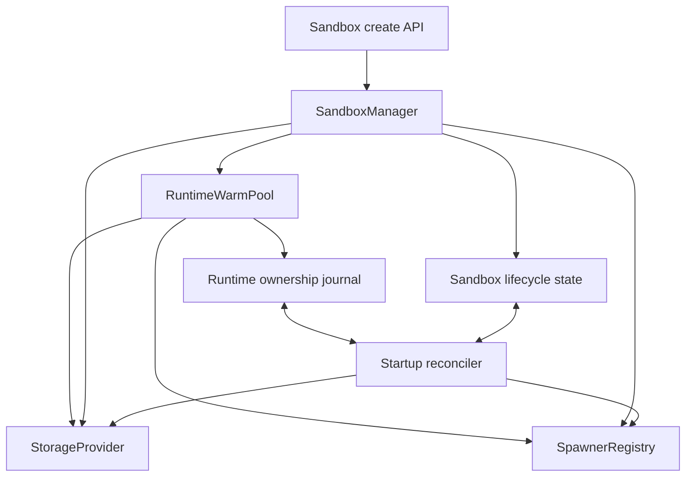
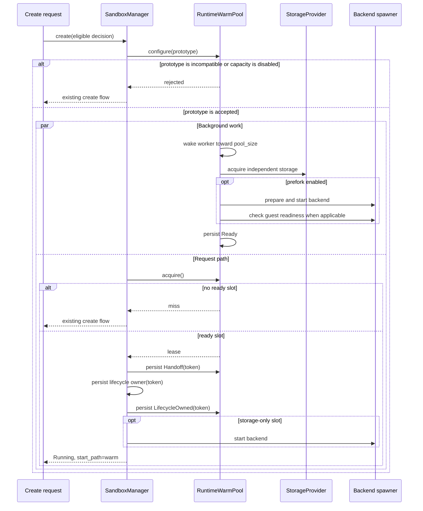
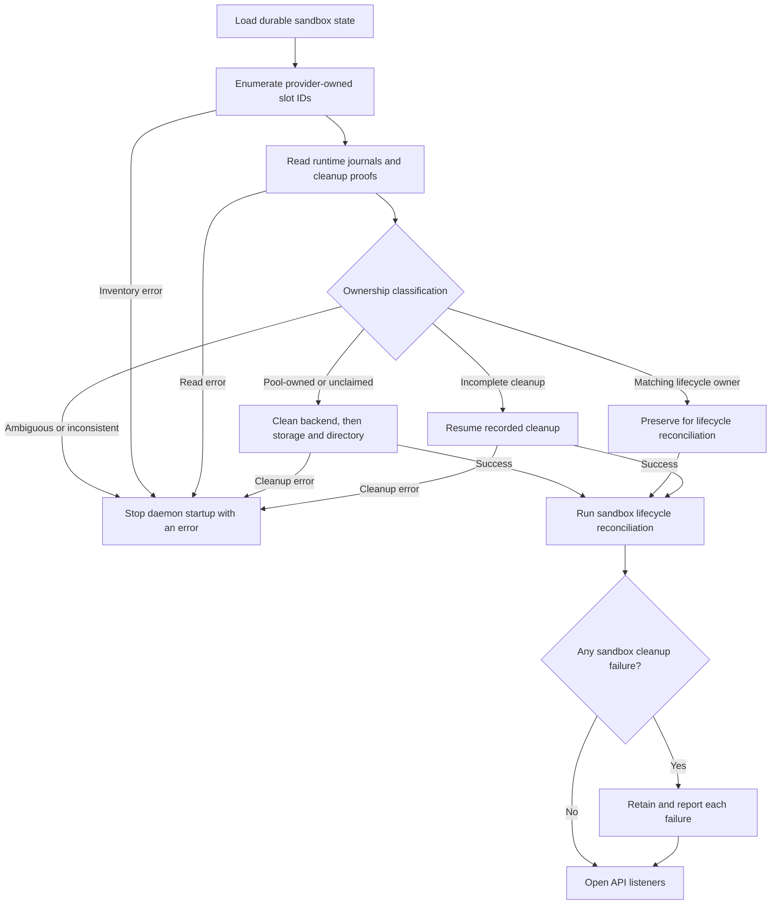

# Runtime Slot Ownership

## Purpose

Background runtime capacity reduces the work on a compatible sandbox create
without allowing partially built storage or backend processes to lose an
owner. Each prepared slot has independent storage and may also own a running
backend. The daemon records who owns those resources before and during every
handoff, cleanup, restart, and shutdown transition.

This design covers background construction, claim, ownership transfer, and
recovery. It does not add a public runtime-capacity management API, restore
ready slots after restart, or change the existing lifecycle recycling pool
served by `/v1/pools`.

## Inputs and Activation

The daemon reads these runtime-capacity settings:

| Setting | Effect |
| --- | --- |
| `storage.pool_size` | Maximum pool-owned and in-flight slot count; zero disables construction |
| `storage.prefork` | Whether a slot starts its selected backend before becoming ready |
| `pool.default_warm_ttl` | Ready-slot lifetime when an eligible policy has no override |
| `pool.gc_interval` | Maintenance interval for expiry, cleanup, and refill work |
| policy `pool.enabled` | Whether creates evaluated by that policy may configure or claim a slot |
| policy `pool.warm_ttl` | Optional lifetime override for that policy's accepted build shape |

The first eligible create fixes one prototype for the current daemon run.
Later creates must produce the same prototype fingerprint to claim its slots.
An incompatible request continues through the existing create flow and does
not replace the active prototype.

## Components



- `RuntimeWarmPool` owns the bounded worker, ready queue, leases, and pending
  cleanup.
- `StorageProvider` creates independent slots. Non-zero capacity requires a
  provider that can enumerate every ID it owns and release an ID even when
  creation stopped partway through.
- `SpawnerRegistry` starts the configured backend. During recovery, the
  persisted backend kind selects its cleanup implementation; recovery does not
  restart or adopt the old process.
- `SandboxManager` is the transfer boundary between pool ownership and normal
  sandbox lifecycle ownership.
- The startup reconciler compares runtime journals, provider inventory, and
  durable lifecycle state before the API starts listening.

Provider- and backend-specific behavior remains behind the existing traits.
The pool records stable IDs and ownership facts; it does not persist a concrete
provider implementation or choose a replacement backend after failure.

## Slot Construction



Construction is asynchronous. The request that first configures the prototype
does not wait for a slot to finish. The worker fills only while the number of
physical pool owners is below `pool_size`.

Before calling provider allocation, the journal conservatively records that
storage may be owned. This permits release by ID if cancellation occurs after
the provider created an artifact but before it returned a complete slot. When
`prefork` is enabled, backend ownership is recorded as it moves from not
started, through starting, to running. A slot becomes `Ready` only after all
configured preparation succeeds.

## Ownership States

The persisted runtime journal uses these phases:

```mermaid
stateDiagram-v2
    [*] --> Building
    Building --> Ready: storage and optional backend prepared
    Building --> PoolCleanup: build cannot complete
    Ready --> Handoff: lease records token
    Ready --> PoolCleanup: expiry or failed liveness check
    Handoff --> LifecycleOwned: matching lifecycle owner is durable
    Handoff --> PoolCleanup: lifecycle publication is absent
    Handoff --> LifecycleCleanup: visible lifecycle owner begins cleanup
    LifecycleOwned --> LifecycleCleanup: destroy or failed create cleanup
    PoolCleanup --> [*]: backend, storage, and directory released
    LifecycleCleanup --> [*]: runtime released; lifecycle state retained as Destroyed
```

The handoff token links one runtime journal to one lifecycle record. A phase
change is accepted only with the matching instance ID, backend, backend
ownership, and token. This prevents a stale cleanup path from reclaiming a
slot that a sandbox already owns.

An in-memory lease has one synchronous drop owner:

- before lifecycle publication, drop returns the slot to pool cleanup;
- after lifecycle state is retained, drop removes it from pool accounting and
  leaves cleanup to the lifecycle owner;
- when publication cannot be classified, the pool retains an unresolved
  handoff instead of choosing either owner.

## Capacity Accounting

The target counts physical resources, not only ready entries:

```text
physical count =
    ready
  + building
  + leased
  + quarantined
  + unresolved handoffs
  + cleanup in progress
```

The worker starts another build only when this sum is below
`storage.pool_size`. A failed cleanup therefore cannot silently create excess
capacity. Once a handoff completes and the lease leaves pool accounting, the
active sandbox is governed by lifecycle ownership and no longer consumes the
runtime-slot target.

## Failure Decisions

| Failure point | Durable decision | Result |
| --- | --- | --- |
| Before or during storage allocation | `Building`, with conservative storage ownership before the call | Release by stable ID; retry cleanup if release fails |
| Backend prepare, start, or readiness | `Building` plus the latest backend ownership | Keep residual owners, move to pool cleanup, and retry |
| Ready slot expired or backend exited | Pool still owns the lease | Quarantine and clean it; try another ready slot |
| Lifecycle publication is definitely absent | `Handoff(token)` remains pool-authorized | Lease drop schedules pool cleanup |
| Lifecycle publication is visible but reports failure | Matching lifecycle record is retained | Finish lifecycle ownership, then run failed-create cleanup |
| Lifecycle publication is ambiguous | `Handoff(token)` is retained as unresolved | Keep it counted and require startup reconciliation |
| Pool or lifecycle cleanup stops partway through removal | The cleanup journal remains; a deletion proof also remains if directory removal began | Resume the same cleanup after restart |
| Pool cleanup attempt fails | Pool owner remains in its cleanup phase | Retry with backoff without returning the slot to ready |
| Lifecycle cleanup attempt fails | Lifecycle owner remains retryable | Report it; retry only through destroy, startup, or shutdown |

Failure handling preserves the original error together with cleanup errors.
The caller never receives a successful warm create until lifecycle state is
`Running` and no create operation remains open.

## Startup Reconciliation

Runtime reconciliation runs before socket binding:



The ready queue is process-local and is not restored. Valid unclaimed slots
are cleaned, while slots with a matching durable lifecycle owner are protected
for normal sandbox reconciliation. A runtime inventory, journal read, or
runtime cleanup error stops startup. Once runtime ownership is consistent,
ordinary sandbox reconciliation runs; one sandbox cleanup failure is retained
and reported without preventing listener startup. Unknown entries, mismatched
tokens, unexpected aliases, or conflicting ownership evidence also stop
startup rather than selecting an owner by guesswork.

Recovery uses the backend recorded in the journal and the provider configured
for the same owned directories. Operators must keep those roots and provider
selection stable across restart.

## Shutdown

Shutdown first stops accepting work, cancels readiness waits, and drains
accepted connections. One shared deadline then covers concurrent lifecycle
cleanup and runtime-pool shutdown. The pool joins its single worker and cleans
pool-owned resources, while sandbox cleanup runs through per-sandbox operation
locks and lifecycle ownership.

If the shutdown future itself is cancelled, the worker handle is retained so a
later shutdown attempt can still join it. A timeout stops new construction but
does not rewrite unresolved ownership as success.

## Concurrency Rules

- One maintenance task serializes build and cleanup actions.
- The in-memory state lock protects queues and counters but is not held across
  provider or backend calls.
- One operation lock serializes create, destroy, and guest work for a sandbox.
- Runtime handoff is published before lifecycle mutation continues.
- Shutdown uses a fixed lock order and a shared deadline so worker join and
  resource cleanup cannot wait indefinitely on one another.

## Public Surface

The feature changes `POST /v1/sandboxes` and its `/v1/instances` alias:
compatible requests may return a top-level `start_path` value of `"warm"` and
a nested `instance.runtime_location` value of `"warm-pool"`. `start_path`
remains a generic classification; `runtime_location` identifies this ownership
path. Configuration is the only public control surface for runtime-slot
capacity in this design.

The following existing surfaces are separate:

- `/v1/pools` exposes the separate lifecycle recycling-pool management
  contract, but public reset still returns `501` and no production path returns
  a used sandbox to that pool;
- the health response's `storage_pool` object reports provider storage-pool
  status;
- neither surface reports, drains, or refills background runtime slots.

## Test Mapping

| Contract | Representative coverage |
| --- | --- |
| Storage-only and prefork claims complete create and destroy | `non_prefork_runtime_claim_completes_create_and_destroy`, `prefork_runtime_claim_completes_create_and_destroy` |
| Effective daemon TTL is visible when policy TTL is omitted | `omitted_policy_ttl_is_resolved_in_create_response` |
| All owned and in-flight states count toward the target | `every_owned_state_consumes_physical_capacity` |
| Failed allocation or prefork work retains cleanup ownership | `residual_acquire_failure_remains_owned_until_cleanup`, `residual_prefork_failure_remains_owned_until_cleanup` |
| Handoff ambiguity remains counted until reconciliation | `ambiguous_lifecycle_publish_remains_counted_until_restart`, `unresolved_handoff_counts_capacity_and_blocks_shutdown` |
| Startup protects lifecycle owners and cleans pool owners | `reconcile_protects_durable_lifecycle_owner`, `reconcile_releases_provider_only_slot_by_id` |
| Interrupted cleanup resumes from durable evidence | `reconcile_finishes_deletion_when_only_the_proof_remains`, `reconcile_resumes_lifecycle_tombstone_after_journal_unlink` |
| Shutdown joins the worker and preserves cancellation recovery | `shutdown_joins_worker_and_shares_one_deadline`, `cancelled_shutdown_retains_worker_for_a_joining_retry` |
